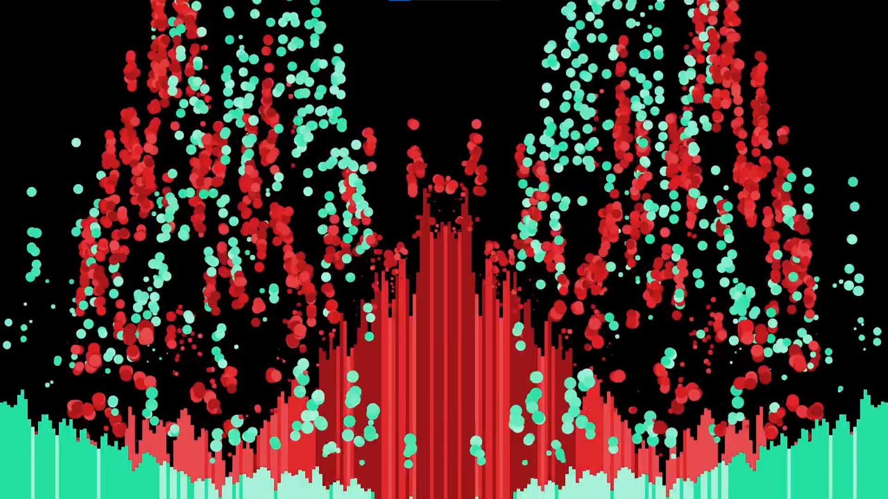

# Coding Projects

Here are most of the projects I did that mainly involved coding. A lot of the projects here were made to solve specific problems I faced, while others are just things that I found interesting and wanted to try out myself.

Many of the projects here are connected to one another and to projects in some of my other repositories. Some projects here also have interactive demos so you can play with them yourself. The related links will all be included.

## Canvas Color Show

This was probably one of my most complicated web based projects. My dad's birthday was coming up and at that time, I was really inspired by Microsoft Flight Simulator 2020's Trailer Music. I decided to combine these two things and create a sort of interactive color show as a birthday gift. 

This project incorporated the Web Audio API to generate the visualizers and image masking at the end to display any custom ending text. I followed many, many tutorials to get this project working and I can not thank all the wonderful educational YouTubers for making these coding tutorials enough. Thank you!!

||||
|-|-|-|
||||

|You can watch the show at: [itscollegetime.github.io/coding-projects/ColorShow](https://itscollegetime.github.io/coding-projects/ColorShow/)|You can also watch a recorded video on YouTube|
|-|-|
|[<video autoplay loop muted src="suppvids/CCC.mp4"></video>](https://itscollegetime.github.io/coding-projects/ColorShow/)|<iframe src="https://www.youtube.com/embed/alWz4vffrAs?si=EhcamWOOcAjHKtvf" title="YouTube video player" frameborder="0" allow="accelerometer; autoplay; clipboard-write; encrypted-media; gyroscope; picture-in-picture; web-share" allowfullscreen></iframe>|

Music: [Fishing Move Inc. - E3 2021 Trailer Music | MSFS 2020 Trailer Score](https://youtu.be/1VNDn7ru2lY?si=n6DZshKkYxZK65BD)

## Canvas New Year Fireworks

This project was really the culmination of many smaller projects. I come from Taiwan and each year during New Year, I make something that resembles the firework show that happens at the iconic Taipei 101. After playing around with making fireworks in HTML Canvas, I decided to combine it with the music syncing experiences gained from making Color Show to make a special firework show of my own in the browser.

||||
|-|-|-|

|You can watch the show at: [itscollegetime.github.io/coding-projects/NewYearCanvas](https://itscollegetime.github.io/coding-projects/NewYearCanvas/)|You can also watch a recorded video on YouTube|
|-|-|
|[<video autoplay loop muted src="suppvids/CNYF.mp4"></video>](https://itscollegetime.github.io/coding-projects/NewYearCanvas/)|<iframe src="https://www.youtube.com/embed/cn_ZovVaCFk?si=-APebhMO843ACi1m" title="YouTube video player" frameborder="0" allow="accelerometer; autoplay; clipboard-write; encrypted-media; gyroscope; picture-in-picture; web-share" allowfullscreen></iframe>|

Music: [Fishing Move Inc. - Pre Order Trailer Music | MSFS 2020 Trailer Score](https://youtu.be/1LIC685WZxI?si=ZS04sWN7ICEp3FZp)

### Canvas Fireworks

This was an exploratory project that mainly focused on particles and related effects. This project was inspired by Canvas Shooter (see below).

|You can try Canvas Fireworks at: [itscollegetime.github.io/coding-projects/CanvasFireworks](https://itscollegetime.github.io/coding-projects/CanvasFireworks/)|You can also watch a recorded demo on YouTube|
|-|-|
|[<video autoplay loop muted src="suppvids/CF.mp4"></video>](https://itscollegetime.github.io/coding-projects/CanvasFireworks/)|<iframe src="https://www.youtube.com/embed/6WCUybQo0S0?si=DAAPlti1TglH29Vs" title="YouTube video player" frameborder="0" allow="accelerometer; autoplay; clipboard-write; encrypted-media; gyroscope; picture-in-picture; web-share" allowfullscreen></iframe>|

### Canvas Shooter

This project was made following a [tutorial video by Chirs Courses on YouTube](https://youtu.be/eI9idPTT0c4?si=KEkh28LMArXA5l3f). 

|You can play Canvas Shooter at: [itscollegetime.github.io/coding-projects/CanvasShooter](https://itscollegetime.github.io/coding-projects/CanvasShooter/)|You can also watch a recorded demo on YouTube|
|-|-|
|[<video autoplay loop muted src="suppvids/CS.mp4"></video>](https://itscollegetime.github.io/coding-projects/CanvasShooter/)|<iframe src="https://www.youtube.com/embed/cMOdi7YpvIA?si=o2uqGY7IFEhUXzlU" title="YouTube video player" frameborder="0" allow="accelerometer; autoplay; clipboard-write; encrypted-media; gyroscope; picture-in-picture; web-share" allowfullscreen></iframe>|

## Elastic Collision Simulator