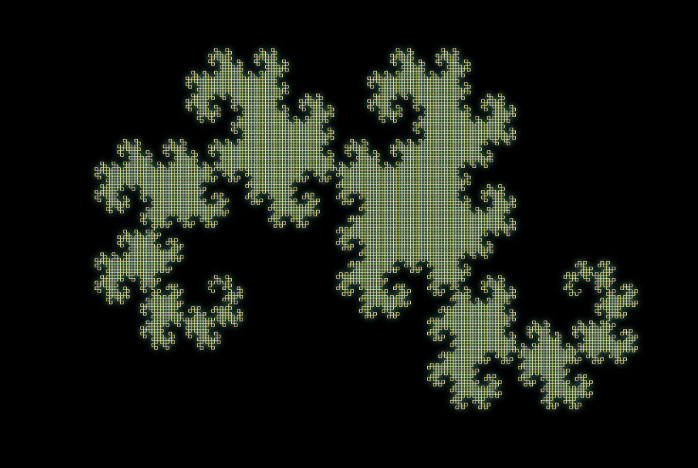
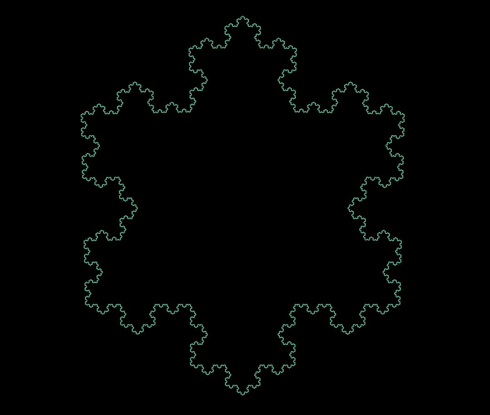
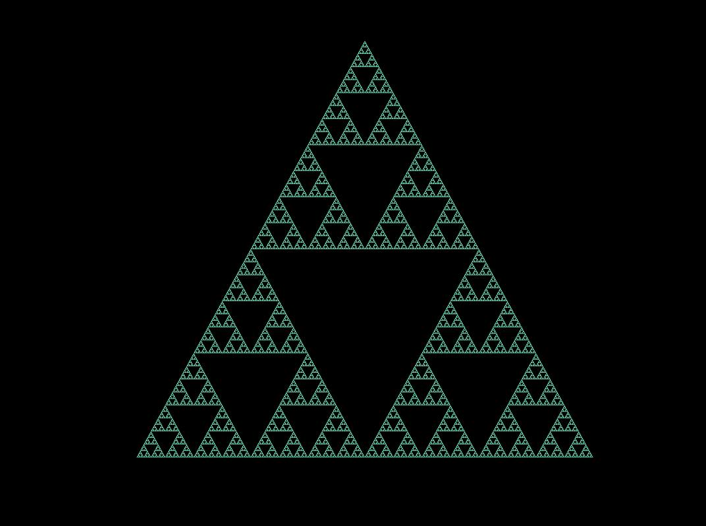
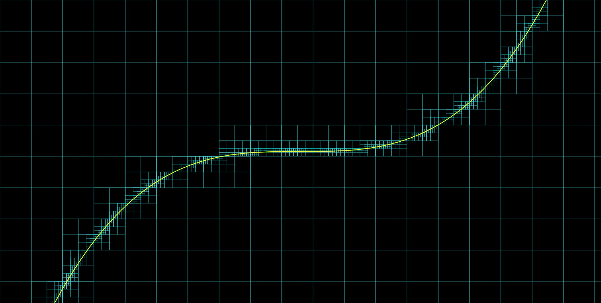
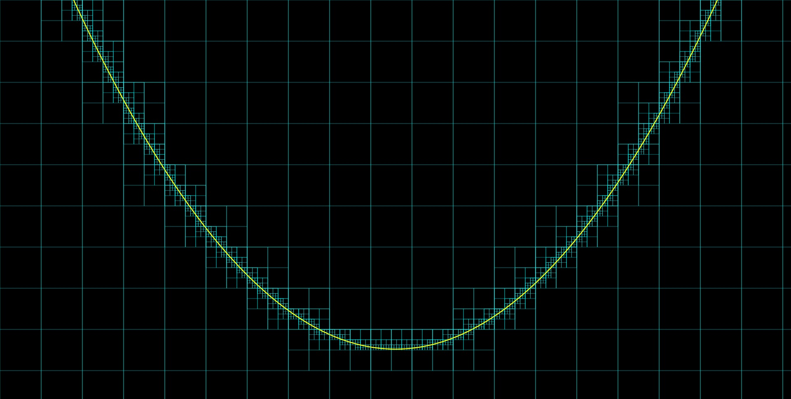
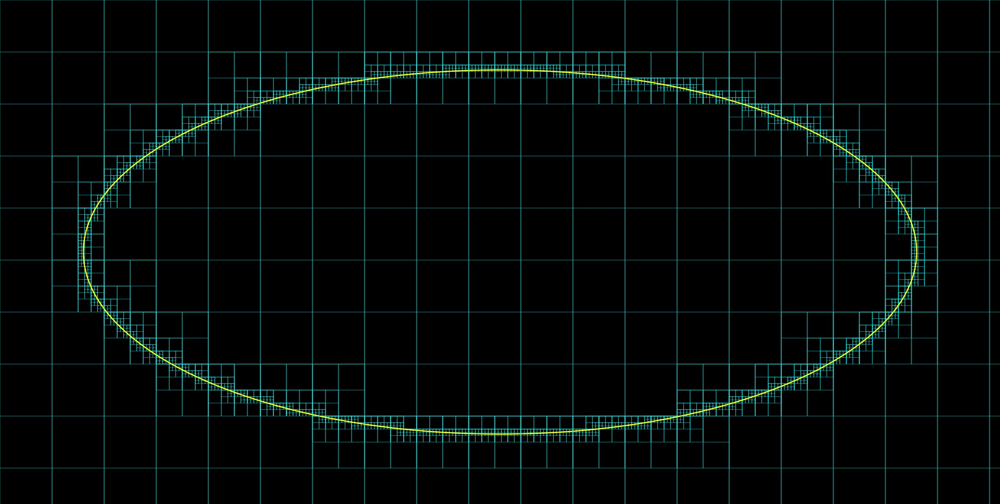
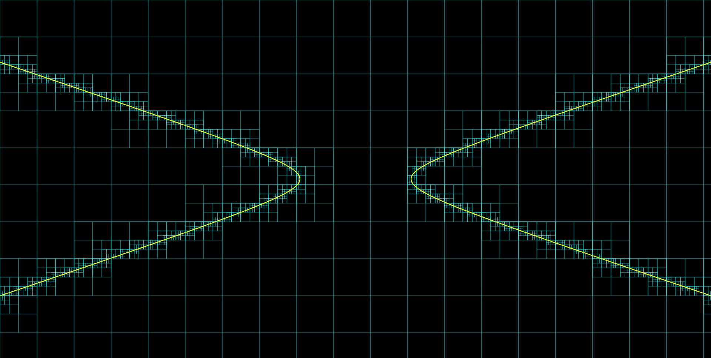
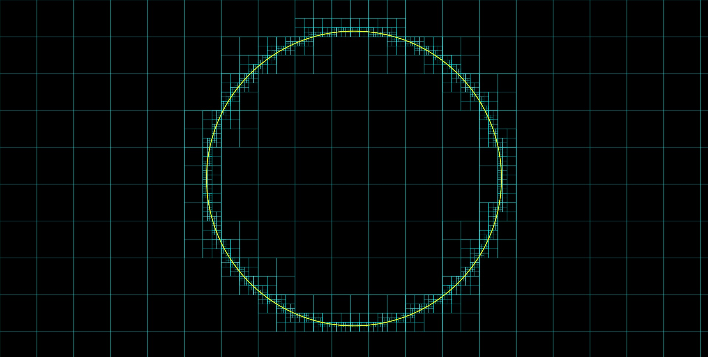
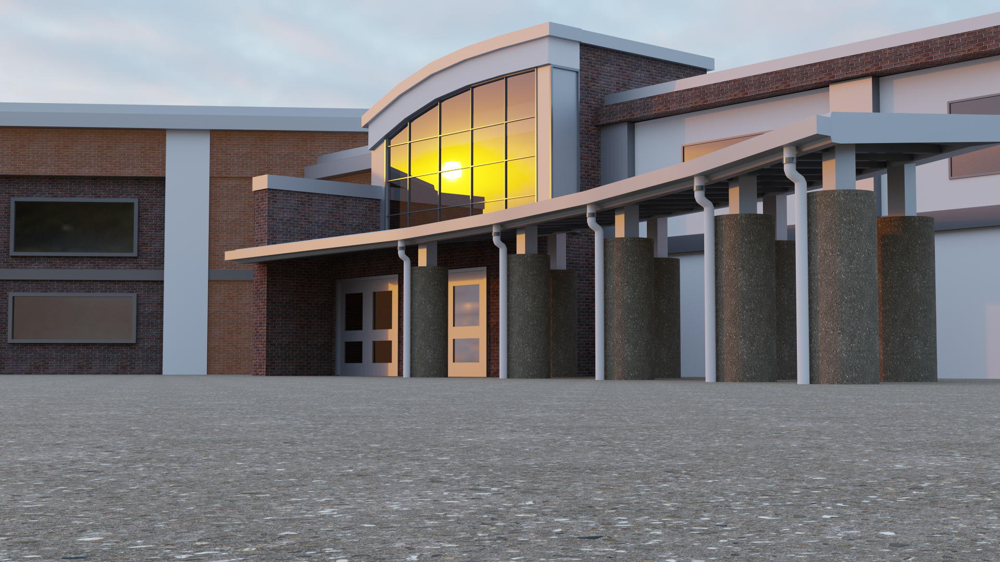

# Coding Projects

Here are most of the projects I did that mainly involved coding. A lot of the projects here are just things that I found interesting and wanted to try out myself, while others were made to solve specific problems I faced.

Many of the projects here are connected to one another and to projects in some of my other repositories. Some projects here also have interactive demos so you can play with them yourself. The related links will all be included.

## Canvas Color Show

This was probably one of my most complicated web based projects. My dad's birthday was coming up and at that time, I was really inspired by Microsoft Flight Simulator 2020's Trailer Music. I decided to combine these two and create a sort of interactive color show as a birthday gift. 

This project incorporated the Web Audio API to generate the visualizers and image masking at the end to display any custom ending text. I followed many, many tutorials to get this project working and I can not thank all the wonderful educational YouTubers for making these coding tutorials enough. Thank you!!

||||
|-|-|-|
||||

You can watch the show locally at: [**itscollegetime.github.io/coding-projects/ColorShow**](https://itscollegetime.github.io/coding-projects/ColorShow/)
 
You can also watch a recorded video on YouTube at: [youtube.com/watch?v=alWz4vffrAs](https://www.youtube.com/watch?v=alWz4vffrAs)

|||
|-|-|

Music: [Fishing Move Inc. - E3 2021 Trailer Music | MSFS 2020 Trailer Score](https://youtu.be/1VNDn7ru2lY?si=n6DZshKkYxZK65BD)

## Canvas New Year Fireworks

This project was really the culmination of many smaller projects. I come from Taiwan and each year during New Year, I make something that resembles the firework show that happens at the iconic Taipei 101. After playing around with making fireworks in HTML Canvas, I decided to combine it with the music syncing experiences gained from making Color Show to make a special firework show of my own in the browser.

||||
|-|-|-|

You can watch the show locally at: [**itscollegetime.github.io/coding-projects/NewYearCanvas**](https://itscollegetime.github.io/coding-projects/NewYearCanvas/)
 You can also watch a recorded video on YouTube at: [youtube.com/watch?v=cn_ZovVaCFk](https://www.youtube.com/watch?v=cn_ZovVaCFk)

|||
|-|-|

Music: [Fishing Move Inc. - Pre Order Trailer Music | MSFS 2020 Trailer Score](https://youtu.be/1LIC685WZxI?si=ZS04sWN7ICEp3FZp)

### Canvas Fireworks

This was an exploratory project that mainly focused on particles and related effects. This project was inspired by Canvas Shooter (see below).

You can try Canvas Fireworks at: [**itscollegetime.github.io/coding-projects/CanvasFireworks**](https://itscollegetime.github.io/coding-projects/CanvasFireworks/)
 
You can also watch a recorded demo on YouTube: [youtube.com/watch?v=6WCUybQo0S0](https://www.youtube.com/watch?v=6WCUybQo0S0)

|||
|-|-|

### Canvas Shooter

This project was made following a [tutorial video by Chirs Courses on YouTube](https://youtu.be/eI9idPTT0c4?si=KEkh28LMArXA5l3f). 

You can try Canvas Shooter at: [**itscollegetime.github.io/coding-projects/CanvasGame**](https://itscollegetime.github.io/coding-projects/CanvasGame/)
 
You can also watch a recorded demo on YouTube at: [youtube.com/watch?v=cMOdi7YpvIA](https://www.youtube.com/watch?v=cMOdi7YpvIA)

|||
|-|-|

## Elastic Collision Simulator

As you can probably tell already, I have a lot of projects involving particles. For this project, I decided to make the particles behave more realisticly and try to simulate collision physics between them. Particle colors represent kinetic energy with red being the highest and blue being the lowest.

The kinetic energy formula and conservation of energy were applied under the assumption of lostless energy transfer between collisions and used to calculate resulting velocities of each particle.

You can watch full video demos on YouTube at:
- [youtube.com/watch?v=91I6AwLHc_w](https://www.youtube.com/watch?v=91I6AwLHc_w)
- [youtube.com/watch?v=6KYbqw02PFk](https://www.youtube.com/watch?v=6KYbqw02PFk)

|||
|-|-|

## Particle Playground

For this project, I decided to built an entirely customizable enviroment for users to play around with particles. Java and JavaFX wre used to create the GUI and simulate particle behavior. Collisions between particles were ignored because of their computational intensity, but collisions with the walls were implemented. Users could customize all kinds of properties about the enviroment, including gravity, environment density, timescale, particle velocity, spread, color and much more... This project was really fun to do and seeing all the particles move semi-realistically was really satisfying.

You can watch full video demos on YouTube at:
- [youtube.com/watch?v=y87NSGMbfYU](https://www.youtube.com/watch?v=y87NSGMbfYU)
- [youtube.com/watch?v=SkT9fXMkUPo](https://www.youtube.com/watch?v=SkT9fXMkUPo)

|||
|-|-|

## Perlin Flow Field

After watching a [YouTube video by Chris Courses](https://www.youtube.com/watch?v=na7LuZsW2UM) on flow fields, I was really astonished. I never knew code could be used to generate such beautiful art, and I had to try it out myself.

A Perlin noise grid was randomly generated and that was used to determine the velocity vector of each particle. By varrying particle speed, size, color, opacity, and animating the guiding vectors, many different effects can be achieved. This was the project that allowed me to attend and present a poster at the MIT URTC 2022 Conference. [(See my URTC-2022 repository)](https://github.com/itscollegetime/URTC-2022)

|||
|-|-|
|||

You can watch a full video demo on YouTube at: [youtube.com/watch?v=3mIsK_C0E6A](https://www.youtube.com/watch?v=3mIsK_C0E6A)

|||
|-|-|

## Particle Effects

Here are some other projects I've done involving particles.

### Parallax

By moving particles with different sizes at different speeds, an illusion of parallax is created.

You can try Parallax at: [itscollegetime.github.io/coding-projects/Parallax](https://itscollegetime.github.io/coding-projects/Parallax/)

|||
|-|-|

### Force Fields

By creating points of attraction or repulsion on a particle grid and applying transformations to surrounding particles based on distance, a force field effect can be created.

|||
|-|-|

## Fractal Sketching

Recursively creating fractals is a common computer science practice activity, and I decided to try it out myself. Here are some of the most famous fractals including the Dragon Cruve, Koch snowflake, and Sierpiński triangle

||||
|-|-|-|

## Marching Squares Contour Sketching

After watching a [YouTube video by Reducible](https://www.youtube.com/watch?v=6oMZb3yP_H8) on how computers draw shapes, I decided to try it out myself. Essentially, the screen is divided into small cells. Each cell is then further divided if a coutour passes through it to achieve better resolution. Here are some common functions sketched with this method. 

|||
|-|-|

||||
|-|-|-|

## A* Pathfinding

This project was inspired after going from middle school to high school, maybe because COVID-19 changing everything up, I had not received a map of the school and had some trouble finding where my classes were. Once I finally found a map, I wanted to try making a pathfinder that could help future students find classes easily. In my research, I tried many different search algorithms such as Depth First Search and Breadth First Search when treating each classroom as nodes. Eventually, I found the A* algorithm that was better suited for pathfinding and optimizing for shortest distance efficiently. Here is a simple program I made trying out this algorithm.

You can watch a full video demo on YouTube at: [youtube.com/watch?v=XzCMTdlgqa8](https://www.youtube.com/watch?v=XzCMTdlgqa8)

|||
|-|-|

## FX Space Runner

This was a practice project made following a [tutorial by ]() when I was first learning JavaFX. 

You can watch a full video demo on YouTUbe at: [youtube.com/watch?v=ldyqxdvdQDM](https://www.youtube.com/watch?v=ldyqxdvdQDM)

|||
|-|-|

## AB Study Hall

||||
|-|-|-|

## Drop Scheduler

|||
|-|-|